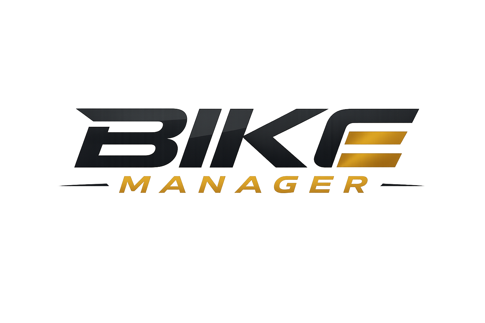

<p align="center">
  
</p>

# Bike Manager

<p align="center">
  <strong>🏍️ Gestiona el mantenimiento, la documentación y la información técnica de tu motocicleta en un solo lugar.</strong>
</p>

---

## 📋 Descripción

**Bike Manager** es una aplicación web diseñada para propietarios de motocicletas premium que desean llevar un control centralizado del mantenimiento de sus vehículos, gestionar información técnica y monitorear los vencimientos documentales.

La plataforma facilita la toma de decisiones relacionadas con el cuidado y conservación de la motocicleta, contribuyendo a prolongar su vida útil y preservar su valor como patrimonio.

---

## 🎯 Objetivos

- Gestionar mantenimientos preventivos y correctivos.
- Registrar información técnica de las motocicletas.
- Controlar vencimientos documentales.
- Mantener un historial detallado de servicios realizados.
- Facilitar la administración de múltiples vehículos.
- Optimizar la experiencia del propietario mediante herramientas digitales.

---

## 🚀 Funcionalidades

### 👤 Gestión de Usuarios
- Registro de usuarios.
- Inicio de sesión seguro.
- Administración de perfiles.

### 🏍️ Gestión de Motocicletas
- Registro de motocicletas.
- Consulta de información técnica.
- Gestión de múltiples vehículos.

### 🔧 Gestión de Mantenimiento
- Registro de mantenimientos preventivos.
- Historial de servicios realizados.
- Seguimiento de cambios de aceite, filtros y otros componentes.

### 📄 Gestión Documental
- Control de vencimiento de SOAT.
- Control de revisión técnico-mecánica.
- Gestión de seguros y pólizas.
- Recordatorios de renovación.

### 📊 Panel Administrativo
- Visualización general del estado de las motocicletas.
- Seguimiento de mantenimientos próximos.
- Gestión centralizada de la información.

---

## 🛠️ Tecnologías Utilizadas

- HTML5
- CSS3
- JavaScript
- Git
- GitHub

---

## 📂 Estructura del Proyecto

```text
Bike_Manager/
│
├── src/
│   └── Logo.png
│
├── index.html
├── login.html
├── registro.html
│
├── login.css
├── registro.css
│
└── README.md
```

---

## ⚙️ Instalación

### 1. Clonar el repositorio

```bash
git clone https://github.com/tu-usuario/Bike_Manager.git
```

### 2. Ingresar al directorio

```bash
cd Bike_Manager
```

### 3. Abrir la aplicación

Abre el archivo `index.html` en tu navegador.

---

## 📈 Estado del Proyecto

🚧 **En desarrollo**

Actualmente se están implementando los módulos de autenticación, gestión de motocicletas y administración de mantenimientos.

---

## 🤝 Contribuciones

Las contribuciones son bienvenidas. Si deseas mejorar el proyecto:

1. Haz un Fork del repositorio.
2. Crea una nueva rama.
3. Realiza tus cambios.
4. Envía un Pull Request.

---

## 👨‍💻 Autor

Proyecto desarrollado como solución para la gestión integral de motocicletas premium.

---

## 📄 Licencia

Este proyecto está bajo la licencia MIT.
